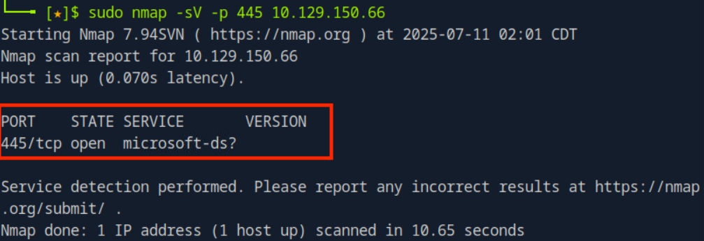
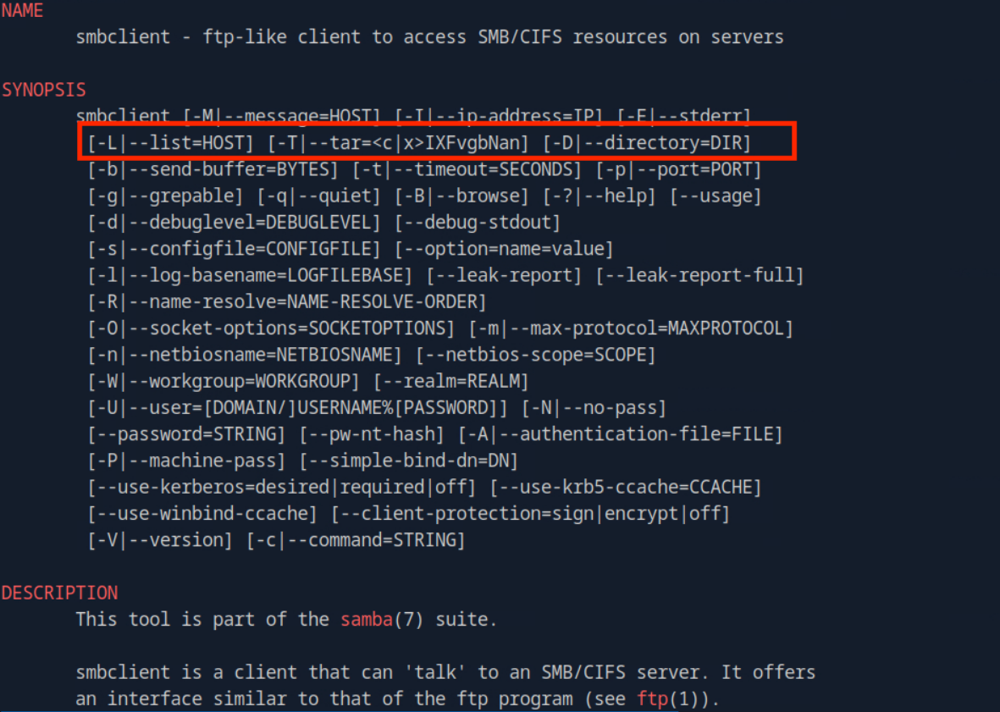
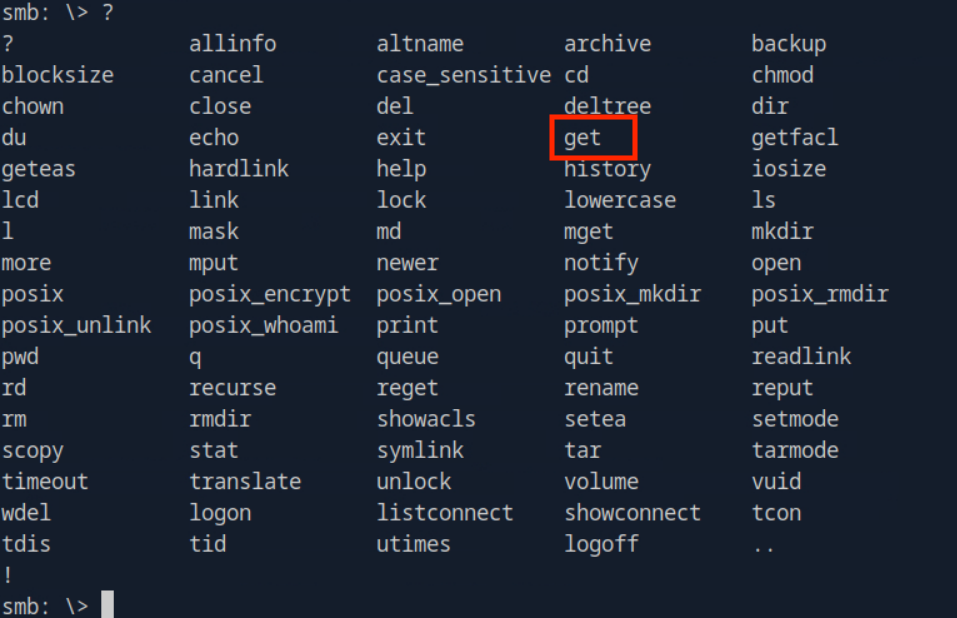
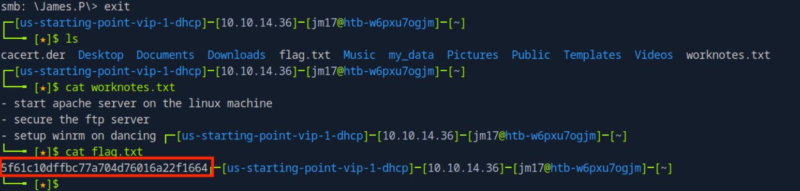

# Dancing [Very Easy]

## **Task 1: What does the 3-letter acronym SMB stand for?**

### A. Server Message Block

## Task 2: **What port does SMB use to operate at?**

### A. 445

## Task 3: **What is the service name for port 445 that came up in our Nmap scan?**

### A. microsoft-ds

Running a simple nmap scan with `-sV` option shows the service of SMB

## Task 4: **What is the 'flag' or 'switch' that we can use with the smbclient utility to 'list' the available shares on Dancing?**

### A.  -L

Running `man smbclient` in the terminal will show all information regarding SMB

## Task 5: **How many shares are there on Dancing?**

### A. 4

Since the `-L` option lists all shares, we can run the `smbclient` command with the target IP

Some SMB servers allow for anonymous or null sessions which does not require authentication (empty password).

## Task 6: **What is the name of the share we are able to access in the end with a blank password?**

### A. WorkShares

Looking at the results from listing all the shares, we can see that all shares besides `WorkShares` have a `$`. The dollar sign controls the visibility of the share. The `$` hides the share from standard users, and generally, only administrative accounts can access it. Shares without a dollar sign are typically open to the public and do not need a password; however, access can still be restricted to only admin accounts.

## Task 7: **What is the command we can use within the SMB shell to download the files we find?**

## A. get

Since we can have access to the Workshares share, we can run `smbclient //[TARGET_IP]/[SHARENAME]`

From here, we can use the `?` option to list all the possible commands and we see that the `get` command can be used to download files from the share.

## Task 8: Submit Flag

### A. **5f61c10dffbc77a704d76016a22f1664**

We can run the `ls` command which shows us two directories currently open. 

Inside the `Amy.J` directory, we notice a file named `worknotes.txt`. While this file may not be important for this specific challenge, it is generally best practice to exfiltrate any piece of information you find in a real penetration test. Even files that appear irrelevant can sometimes contain crucial login credentials or other sensitive information that must be documented.

Inside the `James.P` directory, we find the `flag.txt` file and use the `get`command to download it to our local system.

After exiting `smbclient` , we use the `cat` command to read the contents of each file and see that `flag.txt` file contains the flag for this machine.

