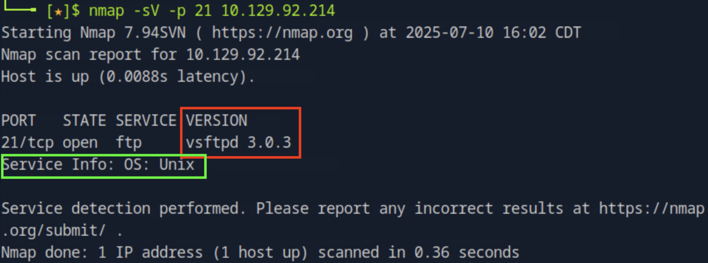
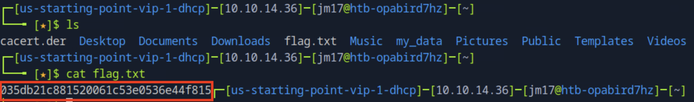

# Fawn [Very Easy]

## Task 1: **What does the 3-letter acronym FTP stand for?**

### A. File Transfer Protocol

## Task 2: **Which port does the FTP service listen on usually?**

### A. 21

## Task 3: **FTP sends data in the clear, without any encryption. What acronym is used for a later protocol designed to provide similar functionality to FTP but securely, as an extension of the SSH protocol?**

### A. SFTP

## Task 4: **What is the command we can use to send an ICMP echo request to test our connection to the target?**

### A. ping

## Task 5: **From your scans, what version is FTP running on the target?**

### A. vsftpd 3.0.3

The `-sV` tag states the server version and `-p` tag specifies a port number to scan.

## Task 6: **From your scans, what OS type is running on the target?**

### A. Unix

From the same image in the last task, we can also see the OS on the target.

## Task 7: **What is the command we need to run in order to display the 'ftp' client help menu?**

### A. ftp -?

## Task 8: **What is username that is used over FTP when you want to log in without having an account?**

### A. Anonymous

Anonymous is a feature on FTP servers that allows for public access of files without requiring an account. Authentication is typically achieved by using the username `anonymous` and a blank password. Having an active anonymous FTP service can lead to information leaks and unauthorized access to sensitive data if not configured properly.

## Task 9: **What is the response code we get for the FTP message 'Login successful'?**

### A. 230

## Task 10: **There are a couple of commands we can use to list the files and directories available on the FTP server. One is dir. What is the other that is a common way to list files on a Linux system.**

### A. ls

## Task 11: **What is the command used to download the file we found on the FTP server?**

### A. get

Running the `help` command lists all the usable commands.

## Task 12: Submit Root Flag

### A. **035db21c881520061c53e0536e44f815**

We can run the `ls` command to see all the files currently in the working directory in the ftp server. However, we cannot use the `cat` command as it is invalid here.

In order to retrieve the flag, you have to download the file from the ftp server using the `get` command.

We now see that once we exit, we can see the flag file from the ftp server and now we can run the `cat` command to view the contents of the flag file.

